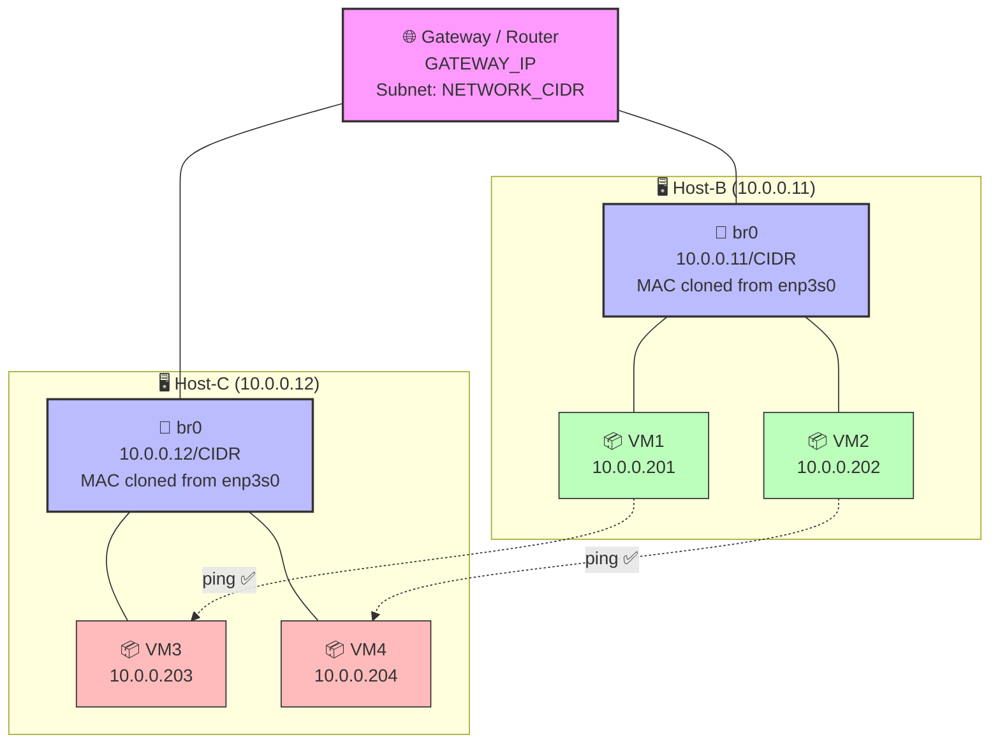
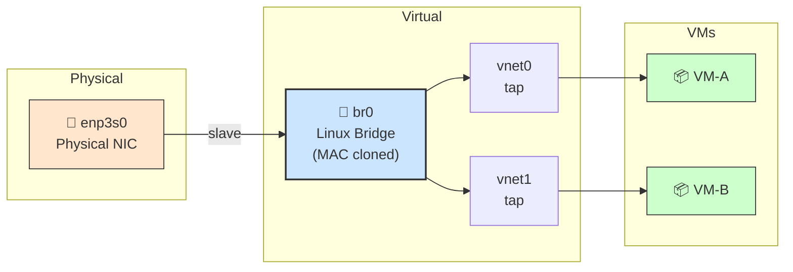
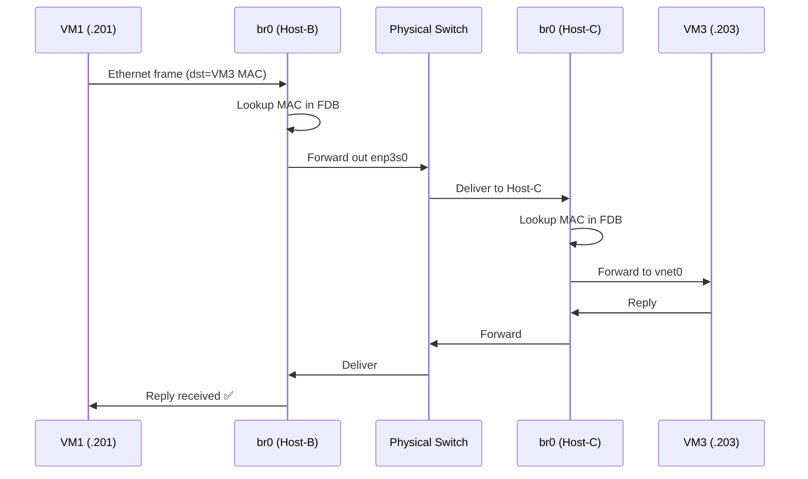
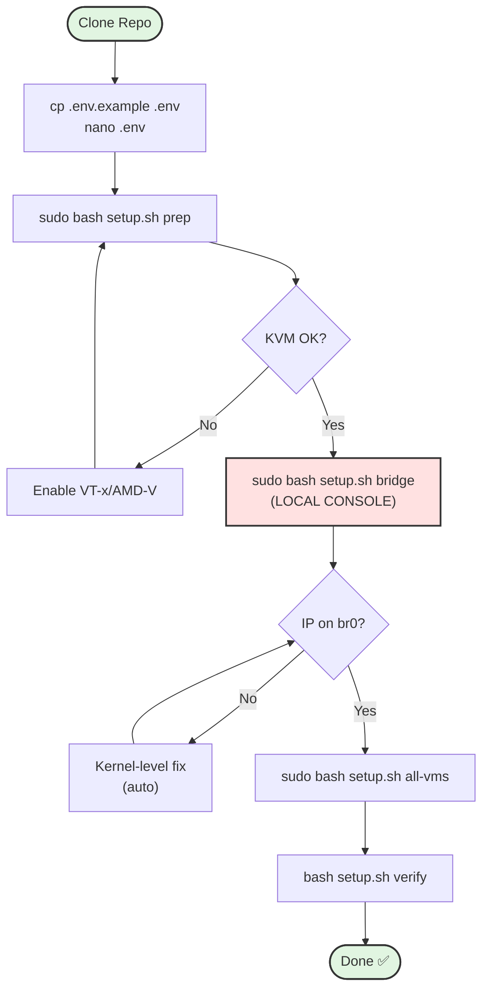
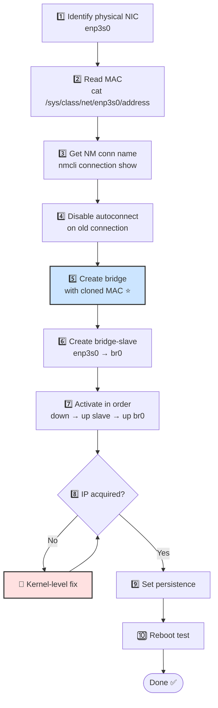
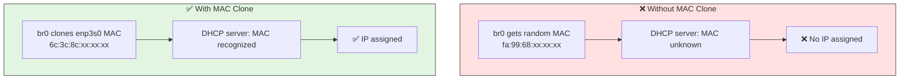
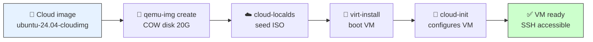
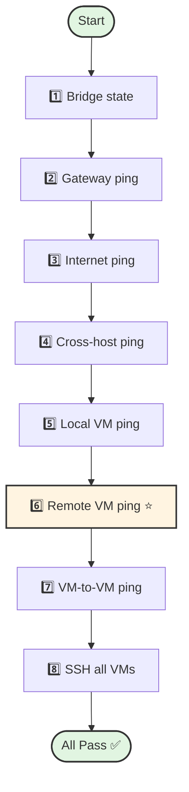
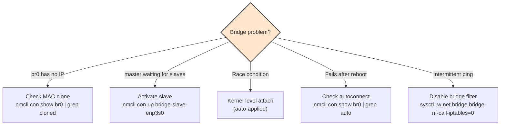
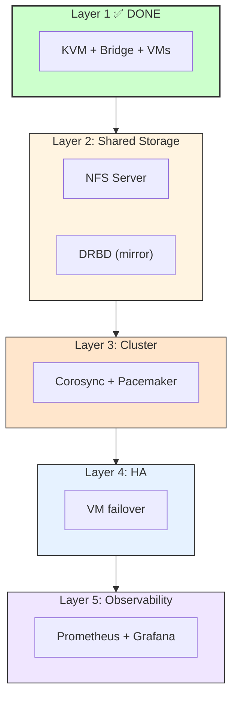

# KVM High Availability Cluster — Pull & Run

> **Portable, GitOps-style KVM cluster setup.** Pull from GitHub → edit `.env` → run one command → done.

[](LICENSE)
[](https://ubuntu.com)
[](https://www.linux-kvm.org)
[](#)

---

## 📋 Table of Contents

1. [Overview](#1-overview)
2. [Architecture](#2-architecture)
3. [Quick Start](#3-quick-start)
4. [Repository Structure](#4-repository-structure)
5. [Configuration (.env)](#5-configuration-env)
6. [Setup Workflow](#6-setup-workflow)
7. [Adding a New Host](#7-adding-a-new-host)
8. [Bridge Network Deep-Dive](#8-bridge-network-deep-dive)
9. [VM Provisioning](#9-vm-provisioning)
10. [Verification](#10-verification)
11. [Troubleshooting](#11-troubleshooting)
12. [Recovery](#12-recovery)
13. [Security](#13-security)
14. [Roadmap](#14-roadmap)
15. [Change VM Network Configuration](#15-change-vm-network-configuration)

---

## 1. Overview

This repository provides a **portable, GitOps-style workflow** for deploying KVM virtualization hosts with Linux bridge networking. It enables **cross-host VM communication**, which is **mandatory** for HA clusters, live migration, and distributed applications.

### What You Get

- ✅ **One-command setup** — `sudo bash setup.sh full`
- ✅ **Per-host `.env` config** — clone once, configure locally
- ✅ **Safe for GitHub** — real credentials never committed
- ✅ **Auto VM provisioning** — cloud-init based
- ✅ **Reboot-survivable** — persistence verified
- ✅ **Full recovery** — rollback to original network

### Why Bridge (Not NAT)?

Default libvirt NAT (`virbr0`) **cannot** route VM traffic across physical hosts.

| Feature | NAT | Linux Bridge |
|---------|:---:|:------------:|
| Host → VM | ✅ | ✅ |
| VM → VM (same host) | ✅ | ✅ |
| **VM → VM (cross-host)** | ❌ | ✅ |
| VM live migration | ❌ | ✅ |
| **Suitable for HA** | ❌ | ✅ |

---

## 2. Architecture

### 2.1 Cluster Topology



### 2.2 Bridge Architecture (Per Host)



### 2.3 Cross-Host Packet Flow



**Key insight:** All VMs share the same Layer-2 broadcast domain. No routing required — the bridge simply forwards frames based on MAC.

---

## 3. Quick Start

### 3.1 For a New Host (Host-C Example)

```bash
# 1. Clone
git clone https://github.com/YOUR_USERNAME/kvm-ha-cluster.git
cd kvm-ha-cluster

# 2. Configure
cp .env.example .env
chmod 600 .env
nano .env     # Edit with your host's real values

# 3. Full setup
sudo bash setup.sh full

# 4. Create VMs
sudo bash setup.sh all-vms

# 5. Verify
bash setup.sh verify
```

**Total time:** ~15 minutes (including package install).

---

## 4. Repository Structure

```
kvm-ha-cluster/
├── .env.example              # Template (committed)
├── .env                      # Your config (gitignored)
├── .gitignore
├── LICENSE
├── README.md
├── setup.sh                  # ⭐ Master script
├── scripts/
│   ├── 01-host-prep.sh
│   ├── 02-bridge-setup.sh
│   ├── 03-vm-create.sh
│   ├── 04-verify.sh
│   └── 05-rollback.sh
├── cloud-init/
│   ├── user-data.template.yaml
│   └── network-config.template.yaml
└── docs/
    └── README-full.md
```

---

## 5. Configuration (.env)

### 5.1 Setup

```bash
cp .env.example .env
chmod 600 .env
nano .env
```

### 5.2 Variables Reference

| Variable | Description | Example |
|----------|-------------|---------|
| `HOST_NAME` | Unique host identifier | `host-c` |
| `HOST_IP` | This host's LAN IP | `10.0.0.12` |
| `HOST_MAC` | Physical NIC MAC | `aa:bb:cc:dd:ee:03` |
| `PHYS_IFACE` | Physical NIC name | `enp3s0` |
| `OLD_CONN` | NM connection name | `Wired connection 1` |
| `BRIDGE_IFACE` | Bridge name | `br0` |
| `GATEWAY_IP` | Network gateway | `10.0.0.1` |
| `NETWORK_CIDR` | CIDR prefix | `24` |
| `DNS_SERVERS` | DNS servers | `8.8.8.8,8.8.4.4` |
| `VM_USER` | Default VM user | `vm` |
| `VM_PASSWORD` | Default VM password | `changeme` |
| `VMS` | VMs on this host | `vm5:10.0.0.205 vm6:10.0.0.206` |
| `CLUSTER_HOSTS` | Other hosts (verify) | `10.0.0.11:host-b` |
| `CLUSTER_VMS` | Other VMs (verify) | `10.0.0.201:vm1` |

### 5.3 Find Values on Your Host

```bash
# IP address
ip -br a show enp3s0 | awk '{print $3}' | cut -d/ -f1

# MAC address
cat /sys/class/net/enp3s0/address

# Interface name
ip -br link

# NM connection name
nmcli -t -f NAME,DEVICE connection show | grep enp3s0

# Gateway
ip route | grep default | awk '{print $3}'

# CIDR prefix
ip -br a show enp3s0 | grep -oP '/\K[0-9]+'
```

### 5.4 Example `.env` (Host-C)

```bash
HOST_NAME="host-c"
HOST_IP="10.0.0.12"
HOST_MAC="aa:bb:cc:dd:ee:03"
PHYS_IFACE="enp3s0"
OLD_CONN="Wired connection 1"
BRIDGE_IFACE="br0"

GATEWAY_IP="10.0.0.1"
NETWORK_CIDR="24"
DNS_SERVERS="8.8.8.8,8.8.4.4"

VM_USER="vm"
VM_PASSWORD="changeme"
VM_VCPU=2
VM_RAM_MB=4096
VM_DISK_SIZE="20G"

CLOUD_IMAGE_URL="https://cloud-images.ubuntu.com/noble/current/noble-server-cloudimg-amd64.img"
CLOUD_IMAGE_PATH="/var/lib/libvirt/images/ubuntu-24.04-cloudimg-amd64.img"
IMAGE_DIR="/var/lib/libvirt/images"

VMS="vm5:10.0.0.205 vm6:10.0.0.206"

CLUSTER_HOSTS="10.0.0.11:host-b"
CLUSTER_VMS="10.0.0.201:vm1 10.0.0.202:vm2 10.0.0.203:vm3 10.0.0.204:vm4"
```

### 5.5 Verify `.env` is Gitignored

```bash
git check-ignore -v .env
# Expected: .gitignore:N:.env  .env

git status
# .env should NOT appear
```

---

## 6. Setup Workflow

### 6.1 Setup Script Commands

| Command | Purpose |
|---------|---------|
| `sudo bash setup.sh full` | Complete setup (prep + bridge) |
| `sudo bash setup.sh prep` | Install KVM stack only |
| `sudo bash setup.sh bridge` | Bridge network only |
| `sudo bash setup.sh vm <name> <ip>` | Create one VM |
| `sudo bash setup.sh all-vms` | Create all VMs from `.env` |
| `bash setup.sh verify` | Run connectivity tests |
| `sudo bash setup.sh rollback` | Restore original network |
| `bash setup.sh status` | Show current state |

### 6.2 Setup Flow



---

## 7. Adding a New Host

To add **Host-D** (or any new host):

```bash
# 1. Clone repo
git clone https://github.com/YOUR_USERNAME/kvm-ha-cluster.git kvm-ha-cluster-host-d
cd kvm-ha-cluster-host-d

# 2. Create .env
cp .env.example .env
chmod 600 .env

# 3. Edit for Host-D
nano .env
#   HOST_NAME="host-d"
#   HOST_IP="10.0.0.13"
#   HOST_MAC="aa:bb:cc:dd:ee:04"
#   OLD_CONN="Wired connection 2"
#   VMS="vm7:10.0.0.207 vm8:10.0.0.208"
#   CLUSTER_HOSTS="10.0.0.11:host-b 10.0.0.12:host-c"
#   CLUSTER_VMS="10.0.0.201:vm1 10.0.0.202:vm2 10.0.0.203:vm3 10.0.0.204:vm4 10.0.0.205:vm5 10.0.0.206:vm6"

# 4. Setup
sudo bash setup.sh full
sudo bash setup.sh all-vms
bash setup.sh verify
```

**একই repo, আলাদা `.env` — infinite scaling!**

---

## 8. Bridge Network Deep-Dive

### 8.1 Bridge Creation Flow



### 8.2 Why MAC Clone is Critical



**Command:**

```bash
sudo nmcli connection add type bridge ifname br0 con-name br0 \
  ipv4.method auto \
  ipv6.method ignore \
  ethernet.cloned-mac-address "$HOST_MAC"
```

### 8.3 Race Condition Fix (Most Common Failure)

**Symptom:** `br0` shows `connecting (getting IP configuration)` forever.

**Root cause:** During transition, `enp3s0` briefly loses carrier. `br0` never receives packets → DHCP timeout.

**Fix (auto-applied by script):**

```bash
# Detach from NM
sudo nmcli device set enp3s0 managed no
sleep 2

# Attach at kernel level (WITHOUT taking enp3s0 down)
sudo ip link set enp3s0 master br0
sudo ip link set br0 up
sudo ip link set enp3s0 up

# Re-enable NM management
sudo nmcli device set enp3s0 managed yes
sleep 3
sudo nmcli connection up "bridge-slave-enp3s0"

ip -br a show br0
```

---

## 9. VM Provisioning

### 9.1 Provisioning Flow



### 9.2 Create VMs

**Single VM:**

```bash
sudo bash setup.sh vm my-vm 10.0.0.207
```

**All VMs from `.env`:**

```bash
sudo bash setup.sh all-vms
```

### 9.3 VM Defaults

| Parameter | Value |
|-----------|-------|
| vCPU | 2 |
| RAM | 4 GB |
| Disk | 20 GB (thin) |
| OS | Ubuntu 24.04 |
| User | `vm` |
| Password | (from `.env`) |
| Network | Bridge `br0` |

### 9.4 Cloud-Init Templates

**`cloud-init/user-data.template.yaml`:**

```yaml
#cloud-config
hostname: ${VM_HOSTNAME}
manage_etc_hosts: true
users:
  - name: ${VM_USER}
    sudo: ALL=(ALL) NOPASSWD:ALL
    lock_passwd: false
chpasswd:
  list: |
    ${VM_USER}:${VM_PASSWORD}
  expire: false
ssh_pwauth: true
packages:
  - openssh-server
  - qemu-guest-agent
runcmd:
  - systemctl enable --now qemu-guest-agent ssh
```

**`cloud-init/network-config.template.yaml`:**

```yaml
version: 2
ethernets:
  enp1s0:
    dhcp4: false
    addresses: [${VM_IP}/${NETWORK_CIDR}]
    routes:
      - to: default
        via: ${GATEWAY_IP}
    nameservers:
      addresses: [${DNS_SERVERS}]
```

---

## 10. Verification

### 10.1 Verification Flow



### 10.2 Run Verification

```bash
bash setup.sh verify
```

### 10.3 Manual Verification

```bash
# Bridge state
ip -br a show br0
bridge link show

# VMs
sudo virsh list --all

# Ping all endpoints
for ip in $(grep -oP '^[A-Z_]+_IP="\K[^"]+' .env); do
  ping -c 1 -W 2 "$ip" > /dev/null 2>&1 && echo "$ip ✅" || echo "$ip ❌"
done

# SSH to VMs
for entry in $VMS; do
  ip="${entry%%:*}"
  ssh -o ConnectTimeout=3 "${VM_USER}@${ip}" hostname
done
```

### 10.4 Communication Matrix

| From \ To | Host-B | Host-C | VM1 | VM2 | VM3 | VM4 |
|-----------|:------:|:------:|:---:|:---:|:---:|:---:|
| **Host-B** | — | ✅ | ✅ | ✅ | ✅ | ✅ |
| **Host-C** | ✅ | — | ✅ | ✅ | ✅ | ✅ |
| **VM1** | ✅ | ✅ | — | ✅ | ✅ | ✅ |
| **VM2** | ✅ | ✅ | ✅ | — | ✅ | ✅ |
| **VM3** | ✅ | ✅ | ✅ | ✅ | — | ✅ |
| **VM4** | ✅ | ✅ | ✅ | ✅ | ✅ | — |

---

## 11. Troubleshooting

### 11.1 Decision Tree



### 11.2 Common Issues

| Symptom | Cause | Fix |
|---------|-------|-----|
| `master waiting for slaves` | Slave not activated | `nmcli con up bridge-slave-enp3s0` |
| `getting IP` forever | MAC not cloned | Recreate bridge with cloned MAC |
| `br0` DOWN, no carrier | enp3s0 not master | Kernel-level `ip link set master` |
| No IP after reboot | Race condition | Kernel fix + verify persistence |
| Ping works, SSH fails | SSH not running | `virsh console <vm>` → `systemctl start ssh` |
| VM not visible on LAN | vnet not attached | `bridge link show` |

### 11.3 Diagnostic Commands

```bash
# Bridge
ip -br a show br0
bridge link show
bridge fdb show br br0

# NetworkManager
nmcli device status
nmcli connection show --active
nmcli connection show br0

# VMs
sudo virsh list --all
sudo virsh domifaddr <vm-name>
sudo virsh dominfo <vm-name>

# Logs
sudo journalctl -u NetworkManager --since "5 min ago"
sudo tail -50 /var/log/libvirt/qemu/<vm-name>.log
```

---

## 12. Recovery

### 12.1 Bridge Rollback

```bash
sudo bash setup.sh rollback
```

Restores:
- Deletes `br0` connection
- Deletes `bridge-slave-enp3s0`
- Detaches `enp3s0` from bridge
- Reactivates original NM connection
- Verifies connectivity

### 12.2 VM Recovery

```bash
# Stuck VM
sudo virsh destroy <vm-name>
sudo virsh start <vm-name>

# Corrupted VM
sudo virsh undefine <vm-name> --remove-all-storage
sudo bash setup.sh vm <vm-name> <vm-ip>
```

### 12.3 Full Host Reset

```bash
# Rollback network
sudo bash setup.sh rollback

# Remove all VMs
for vm in $(sudo virsh list --all --name); do
  [[ -n "$vm" ]] && sudo virsh undefine "$vm" --remove-all-storage
done

# Cleanup
sudo rm -f /var/lib/libvirt/images/*.qcow2
sudo rm -f /var/lib/libvirt/images/*-seed.iso
sudo rm -f /tmp/user-data-*.yaml /tmp/meta-data-*.yaml /tmp/network-config-*.yaml
```

---

## 13. Security

### 13.1 What's Committed vs Local

| File | Committed? | Contains |
|------|:----------:|----------|
| `.env.example` | ✅ Yes | Placeholders only |
| `.env` | ❌ **Gitignored** | Real IPs, MACs, passwords |
| `setup.sh` | ✅ Yes | Scripts |
| `scripts/*.sh` | ✅ Yes | Scripts |
| `cloud-init/*.yaml` | ✅ Yes | Templates |

### 13.2 Before Every Commit

```bash
# 1. Verify .env is ignored
git check-ignore -v .env

# 2. Scan for real values
grep -rn "10\.70\.16\." . 2>/dev/null | grep -v ".git/"
grep -rn "[0-9a-f]\{2\}:[0-9a-f]\{2\}:[0-9a-f]\{2\}" . 2>/dev/null | grep -v ".git/"

# 3. Check staged files
git diff --cached --name-only | grep -E "^\.env$" && echo "❌ .env staged!" || echo "✅ Safe"
```

### 13.3 Password Management

**Recommended:**

- Change `VM_PASSWORD` in production
- Use **SSH keys** instead of passwords:

```bash
# Generate key
ssh-keygen -t ed25519 -N "" -f ~/.ssh/id_ed25519

# Distribute to VMs
for entry in $VMS; do
  ip="${entry%%:*}"
  ssh-copy-id "${VM_USER}@${ip}"
done

# Now passwordless
ssh vm@10.0.0.205
```

### 13.4 `.env` Backup

Since `.env` is gitignored, back it up separately:

```bash
mkdir -p ~/.config/kvm-ha-cluster
cp ~/kvm-ha-cluster/.env ~/.config/kvm-ha-cluster/.env.backup
chmod 600 ~/.config/kvm-ha-cluster/.env.backup
```

Use a password manager (Bitwarden, 1Password, KeePassXC) for long-term storage.

---

## 14. Roadmap

### 14.1 Layered Progression


### 14.2 Phases

| Phase | Task | Time |
|-------|------|------|
| ✅ | KVM + Bridge + VMs | — |
| 🔜 | NFS Shared Storage | 30 min |
| 🔜 | Corosync + Pacemaker Cluster | 1 hr |
| 🔜 | VM Failover Resources | 30 min |
| 🔜 | Failover Testing | 1 hr |
| 🔮 | Prometheus + Grafana | 3 hr |

---

## 15. Change VM Network Configuration

**Purpose:** Safely verify a VM's MAC/IP configuration, update a static Netplan configuration, apply it, validate connectivity, and recover from a failed change.

**Audience:** System Administrators / DevOps / Senior Engineers

> **Safety:** Confirm console/management access before changing network configuration. A wrong IP, gateway, interface name, or YAML indentation can disconnect the VM.

## 15.1. Pre-Change: Identify MAC, IP & Netplan

### Check current neighbor table
```bash
ip neigh
```

### Check interface MAC
```bash
cat /sys/class/net/enp1s0/address
```

### Inspect Netplan
```bash
ls -l /etc/netplan/
sudo netplan get
sudo cat /etc/netplan/50-cloud-init.yaml
```

**checks**
- Confirm the intended interface is `enp1s0`.
- Confirm approved static IP, CIDR/prefix, gateway and DNS.
- Check for multiple Netplan files defining the same interface.
- If network-team IP/MAC binding exists, verify the approved IP is mapped to this VM's MAC.

## 15.2. Backup Before Modification

```bash
sudo cp /etc/netplan/50-cloud-init.yaml \
        /etc/netplan/50-cloud-init.yaml.backup
```

Edit:
```bash
sudo nano /etc/netplan/50-cloud-init.yaml
```

Example static configuration (**replace values with approved settings**):

```yaml
network:
  version: 2
  ethernets:
    enp1s0:
      dhcp4: false
      addresses:
        - x.x.x.202/21
      routes:
        - to: default
          via: x.x.x.1
      nameservers:
        addresses:
          - x.x.x.1
          - 8.8.8.8
```

> **Do not blindly use the example IP.** The address must be reserved/approved for this VM.

## 15.3. Validate & Apply

```bash
sudo netplan generate
sudo netplan apply
```

For risky remote changes, prefer `sudo netplan try` where appropriate, because it provides a rollback path if connectivity is lost.

**Change flow:**

`Backup → Edit → netplan generate → Apply → Verify`

## 15.4. Post-Change Verification

### IP
```bash
ip addr show enp1s0
```
Confirm interface is UP and expected IP/CIDR is present.

### Route
```bash
ip route
```

Expected pattern:
```text
default via 10.70.16.1 dev enp1s0
10.70.16.0/21 dev enp1s0 ...
```

### Link
```bash
ip link show enp1s0
```

Confirm the interface is `UP`.

## 15.5. Connectivity Tests — In This Order

### 15.5.1) Gateway
```bash
ping -c 2 10.70.16.1
```
If this fails, stop and investigate interface, VLAN/L2, ARP, IP/MAC binding, subnet and gateway.

### 15.5.2) Public IP
```bash
ping -c 2 8.8.8.8
```
If gateway works but this fails, investigate routing, firewall, NAT and upstream connectivity.

### 15.5.3) DNS
```bash
ping -c 2 google.com
```
If `8.8.8.8` works but `google.com` fails, investigate DNS.

### Decision Tree
```text
Interface UP?
  └─ No → Fix interface/config
  ↓
Correct IP?
  └─ No → Fix Netplan
  ↓
Gateway reachable?
  └─ No → Check ARP/VLAN/IP-MAC binding/gateway
  ↓
8.8.8.8 reachable?
  └─ No → Check route/firewall/NAT/upstream
  ↓
google.com resolves?
  └─ No → Check DNS
  ↓
Network configuration validated
```

# 15.6. Recovery / Rollback

Restore the **same backup that corresponds to the file changed**:

```bash
sudo cp /etc/netplan/50-cloud-init.yaml.backup \
        /etc/netplan/50-cloud-init.yaml

sudo netplan generate
sudo netplan apply
```

### Important correction

The supplied backup command creates:

```text
/etc/netplan/50-cloud-init.yaml.backup
```

but the supplied recovery command references:

```text
/etc/netplan/99-static.yaml.backup
```

These are different files. Do not mix them.

If the intended file is `99-static.yaml`, back it up first:

```bash
sudo cp /etc/netplan/99-static.yaml \
        /etc/netplan/99-static.yaml.backup
```

Then restore:

```bash
sudo cp /etc/netplan/99-static.yaml.backup \
        /etc/netplan/99-static.yaml

sudo netplan generate
sudo netplan apply
```

# 15.7. Change Checklist

- [ ] VM MAC verified.
- [ ] Approved IP confirmed.
- [ ] Correct interface identified.
- [ ] Correct subnet/prefix configured.
- [ ] Correct gateway configured.
- [ ] DNS configured.
- [ ] Netplan file conflicts checked.
- [ ] Backup created and path recorded.
- [ ] `netplan generate` succeeds.
- [ ] Interface is UP.
- [ ] Expected IP is present.
- [ ] Default route is correct.
- [ ] Gateway ping succeeds.
- [ ] External IP connectivity succeeds.
- [ ] DNS resolution succeeds.
- [ ] Rollback procedure is known before change.

> **Golden Rule:** `netplan apply` is not the end of the change. The change is complete only after IP, route, gateway, external connectivity and DNS have been verified.


## Appendix A: Command Reference

### Bridge

```bash
ip -br a show br0
bridge link show
bridge fdb show br br0
nmcli connection show
nmcli device status
```

### VM

```bash
sudo virsh list --all
sudo virsh start <vm>
sudo virsh shutdown <vm>
sudo virsh destroy <vm>
sudo virsh console <vm>          # exit: Ctrl+]
sudo virsh dominfo <vm>
sudo virsh domifaddr <vm>
sudo virsh undefine <vm> --remove-all-storage
```

### Setup

```bash
sudo bash setup.sh full
sudo bash setup.sh prep
sudo bash setup.sh bridge
sudo bash setup.sh vm <name> <ip>
sudo bash setup.sh all-vms
bash setup.sh verify
sudo bash setup.sh rollback
bash setup.sh status
```

---

## Appendix B: File Locations

| Item | Path |
|------|------|
| Cloud image | `/var/lib/libvirt/images/ubuntu-24.04-cloudimg-amd64.img` |
| VM disks | `/var/lib/libvirt/images/<vm-name>.qcow2` |
| VM seeds | `/var/lib/libvirt/images/<vm-name>-seed.iso` |
| VM XML | `/etc/libvirt/qemu/<vm-name>.xml` |
| VM logs | `/var/log/libvirt/qemu/<vm-name>.log` |
| NM connections | `/etc/NetworkManager/system-connections/` |

---

## License

MIT — see [LICENSE](LICENSE).

---

## Contributing

1. Fork the repo
2. Create a branch (`git checkout -b feature/xyz`)
3. Commit (`git commit -m "Add xyz"`)
4. Push (`git push origin feature/xyz`)
5. Open a Pull Request

**⚠️ Never commit real credentials, IPs, or MACs.**

---

**Version:** 1.1
**Last Updated:** 2026-09-28
**Maintainer:** Alhaj

